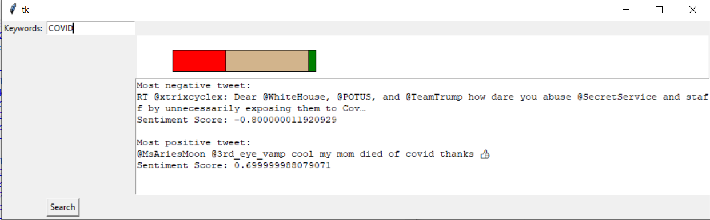
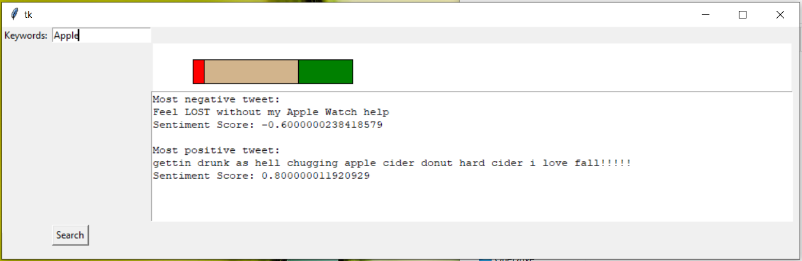
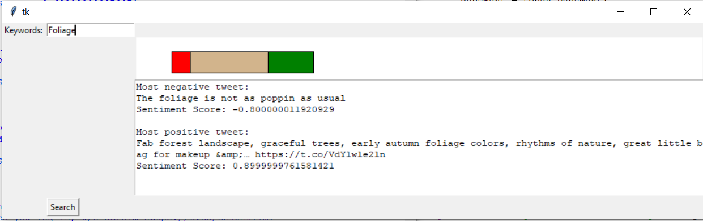

User stories
============
* As New Agency, I  want to be able to get the overall sentiment of the twitter community on political campaigns (national, state and local races)
* As a sports fan, I want to be able to get the average sentiment of my favorite sports teams.
* As a local news agency, I want to be able to display a list of hot twitter topics in my local area, and the general sentiment of local reisdents toward those topics. This will help me get more views etc.
* As a blogger, I want to find the most negative and most positive things people say about a certain topic.
* As a movie rating site, I want to display the most neagtive and most positive things people say about a movie, and the average sentiment.
* As a celebrity, I want to be able to know if people are saying good or bad things about me.
* As a product owner/manager, I want to know if people like my product and why.

Modules (Flow Diagram)
======================

        User picks some keywords
       (e.g. Trump, Patriots, BU, S&P500, Foliage, COVID, Tesla, iPhone)

               |
               v

          Twitter API

               |
               v

       Twitter live stream 

               |
               v
 
        Google NLP (Sentiment analysis)

              |
              V

        Get average sentiment of all tweets
        Save very positive and very negative tweets

             |
             v

        Display to user average sentiment
        and most positive and most negative tweets.
        
Description of Prototype Code
=============================
The program does the following:

1. Asks user for a keyword.
2. Searches Twitter API for recent and popular tweets containing the keywords.
3. Asks Google NLP API to calculate sentiment score for each of the tweets.
4. Display a plot representing the number of positive tweets in green, number of neutral tweets in yellow, and number of negative tweets in red.
5. Display the most negative and most positive tweet.

Examples
--------
Tweets about COVID-19. Lots of negative sentiment.

Tweets about Apple and Foliage. Lots of positive sentiment.

